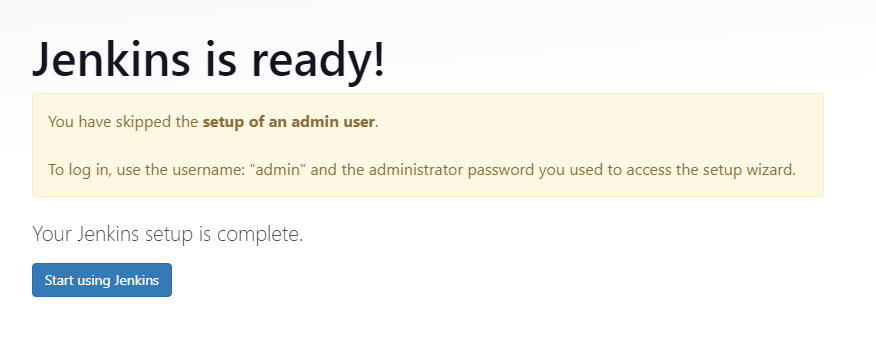
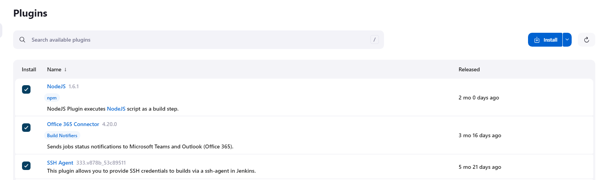
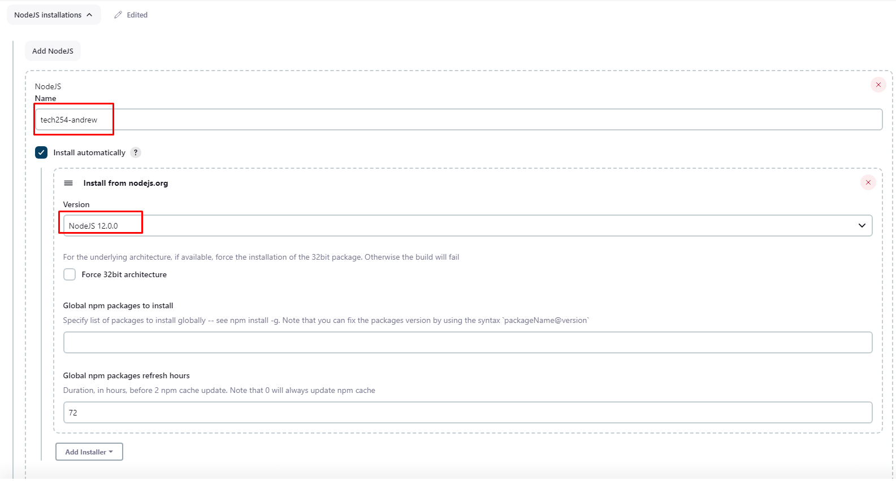
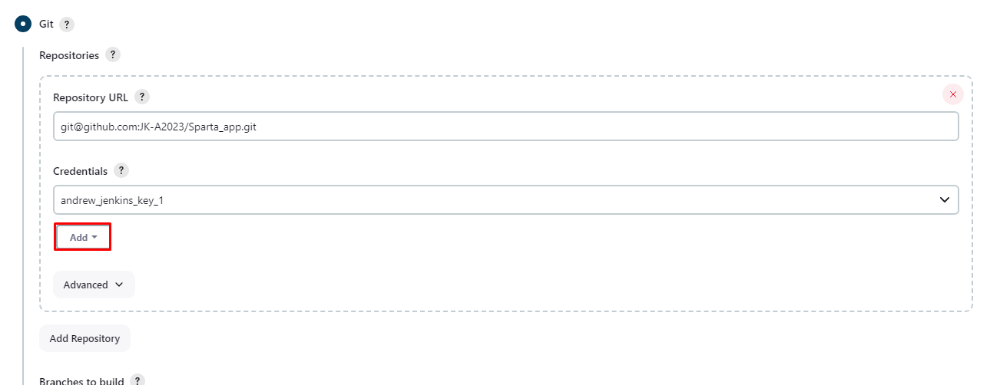

# Creating a Jenkins environment:

## EC2: 

1. Launch an EC2 Instance.
2. Make sure to have Security Group of 8080.
3. SSH into instance.

## Jenkins Installation:

1. Install Jenkins:

```
sudo apt update
sudo apt install openjdk-11-jdk -y
wget -q -O - https://pkg.jenkins.io/debian-stable/jenkins.io.key | sudo apt-key add -
sudo sh -c 'echo deb https://pkg.jenkins.io/debian-stable binary/ > /etc/apt/sources.list.d/jenkins.list'
sudo apt-key adv --keyserver keyserver.ubuntu.com --recv-keys 5BA31D57EF5975CA
sudo apt update
sudo apt install jenkins -y
```

2. Start and enable:

```
sudo systemctl start jenkins
sudo systemctl enable jenkins
```

## Jenkins Set Up:

1. Log into Jenkins using your public ip, with port 8080.
2. Copy your password with the following command:

```
sudo cat /var/lib/jenkins/secrets/initialAdminPassword
```
3. Paste that as the password.

4. For our purposes, we will skip the setup of an admin user.



5. Plugins:
   1. Navigate to plugins and install the following:
      1. `NodeJS`
      2. `Office 365 Connector`
      3. `SSH Agent`



6. Navigate to the Tools section, and scroll to the bottom to configure Node as such:



## Credentials:

To start, we will make the skeleton of a job, so we can set up our credentials.

This takes place in the Source Code Management section:

1. Add new key.



2. Select `SSH Username with private key` from the drop down.
3. Set a username (any)
4. Enter private key from your associated GitHub key attached to a repo previously.
   1. `cat <file> | clip` and paste it.
5. Save this.
6. Following this, enter the following in your instance terminal:

```
ssh-keyscan github.com >> ~/.ssh/known_hosts
```

7. Then log into your jenkins session in the terminal with the following, as well as the github command:

```
sudo su - jenkins

ssh-keyscan github.com >> ~/.ssh/known_hosts
```

