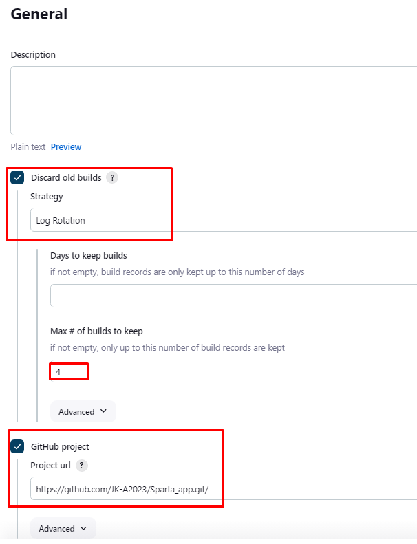
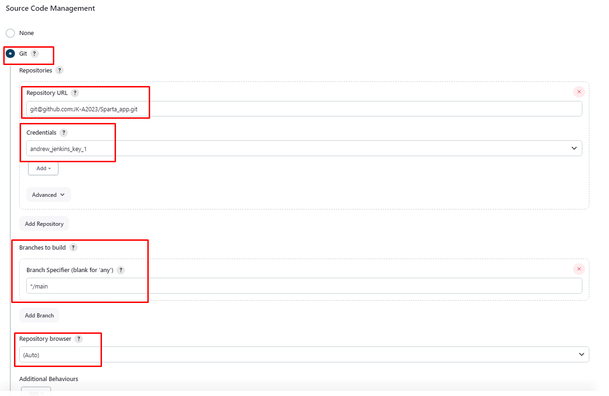
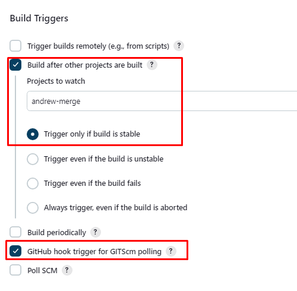
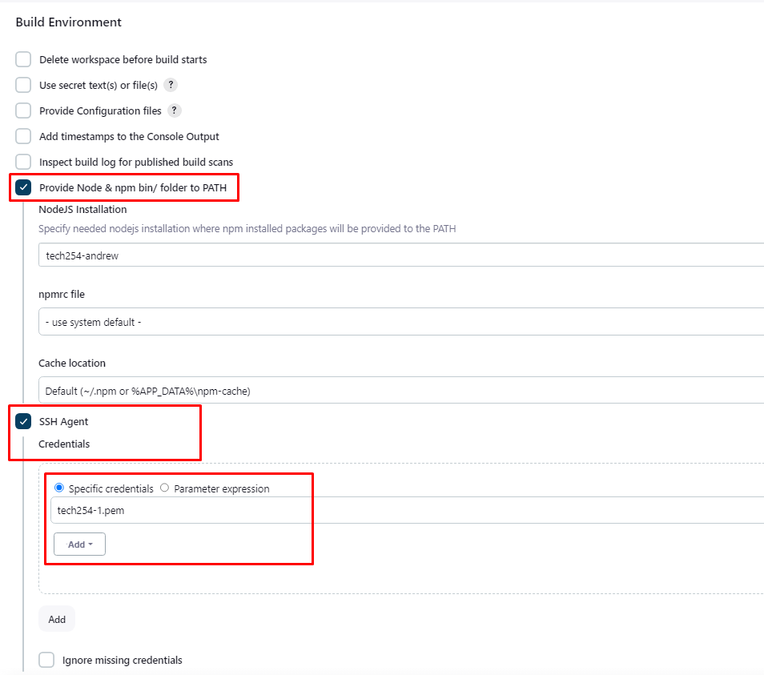

# Jenkins CD Job

## Launch EC2 instance.

1. Using `ami-0136ddddd07f0584f` for AMI.
2. Security Groups:
   1. Port 3000 - Node app listens on 3000
   2. 22 - ssh
   3. 80 - HTTP

This continuous deployment job will SSH into your EC2, update, upgrade, install, and start nginx.

## General:



## Source Code Management:



## Build Triggers:



## Build Environment:



## Build Steps:

```
rsync -avz -e "ssh -o StrictHostKeyChecking=no" app ubuntu@<public_ip>:/home/ubuntu/

ssh -o "StrictHostKeyChecking=no" ubuntu@<public_ip> <<EOF
	sudo apt-get update -y
    sudo apt-get upgrade -y
    sudo apt-get install nginx -y
    sudo systemctl restart nginx 
    sudo systemctl enable nginx
    
EOF
```
