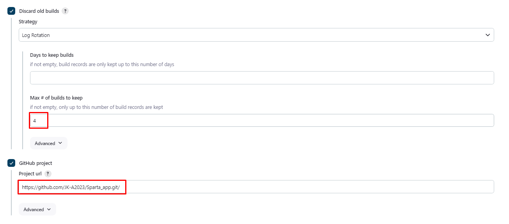
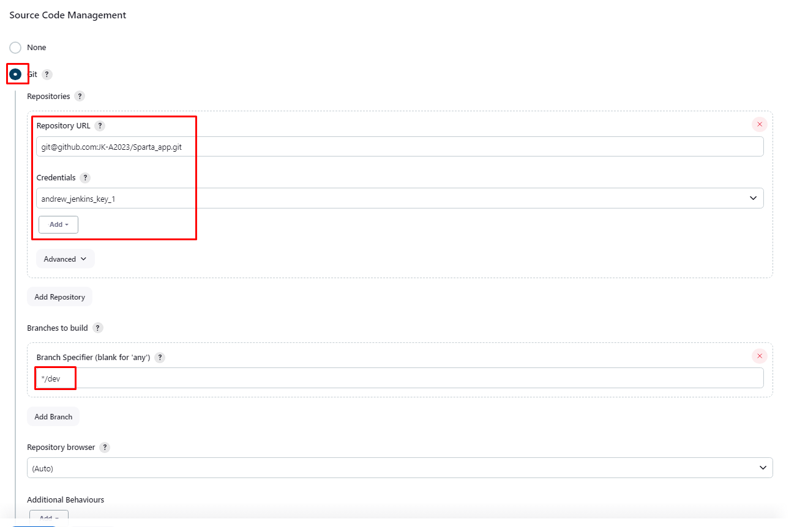
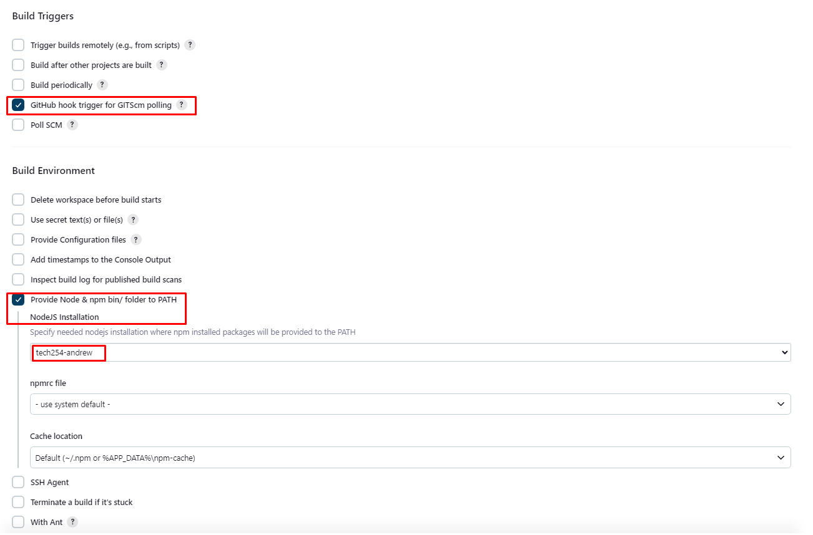

# Setting up CI with Jenkins:

This CI job will clone code onto a Jenkins Virtual Machine every time code is pushed to the Dev branch of the specified repo and test it.

## General:



## Source Code Management:



## Build Triggers and Build Environment:



## Build Steps:

Execute shell:

```
cd app

npm install

npm test
```