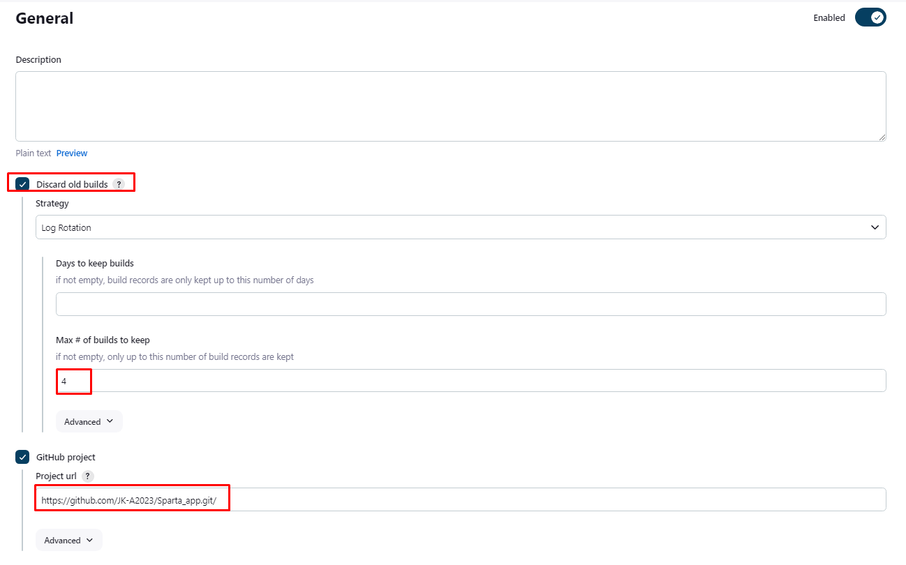
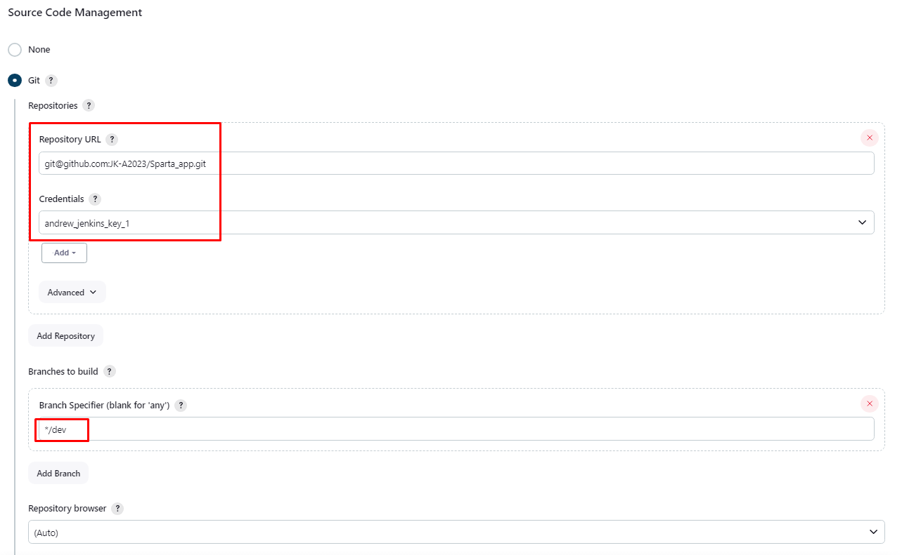
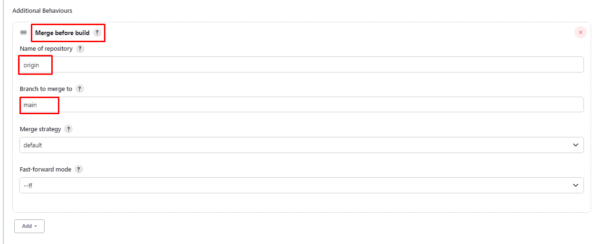
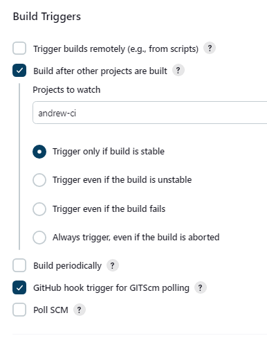
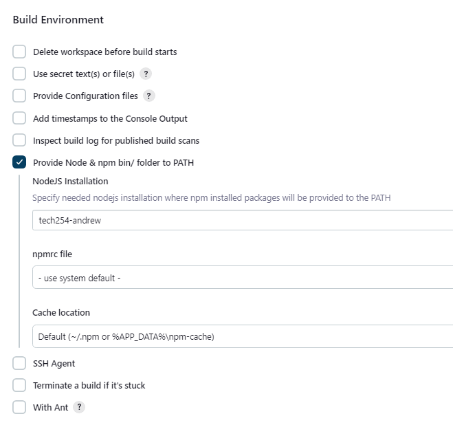
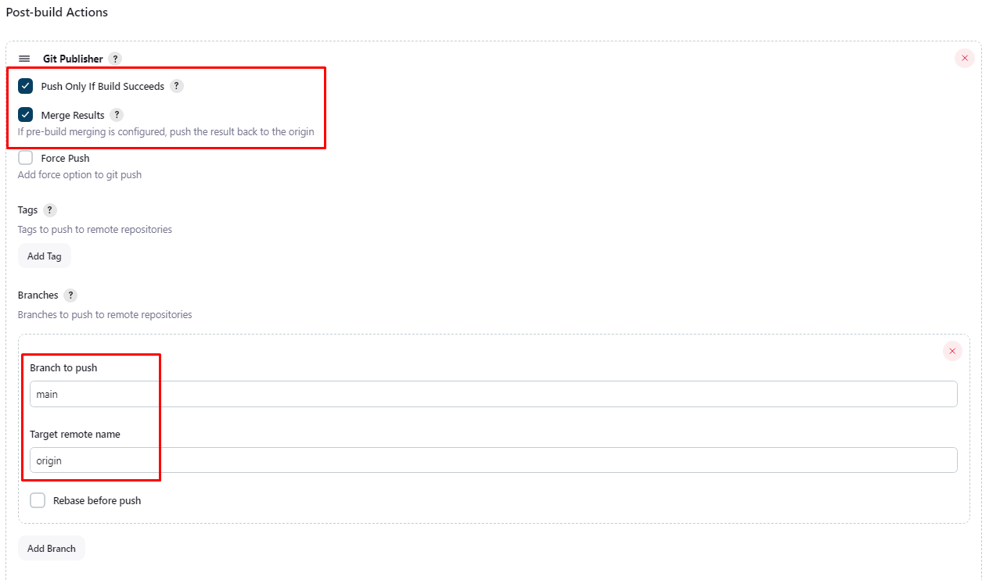
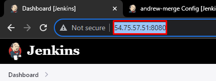
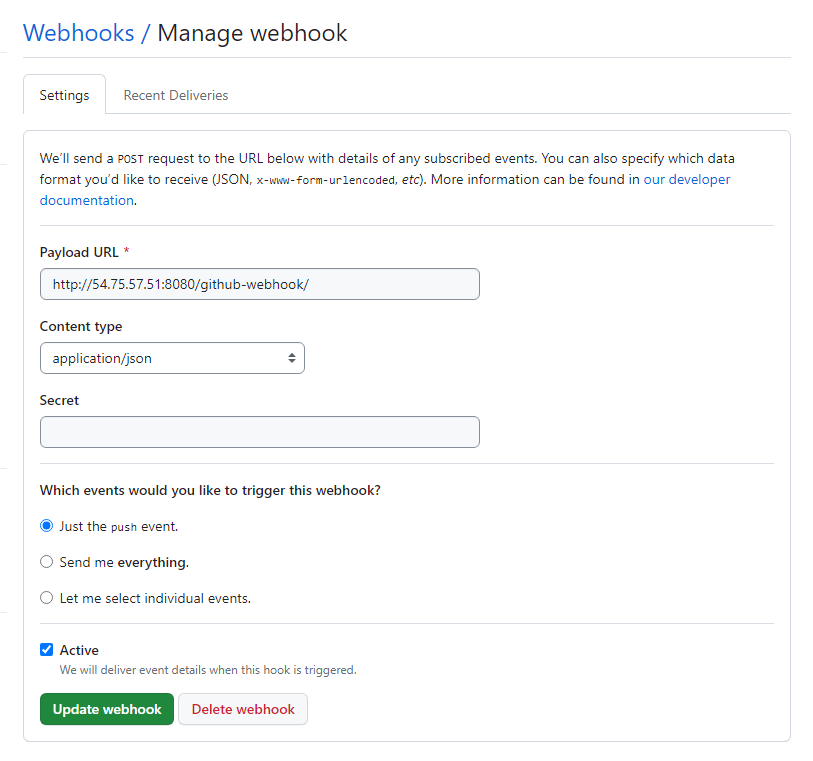

# Jenkins

This Jenkins Merge job will merge the Dev branch of the specified repo with main if the tests of the previous job pass.

### General

### Office 365 Connector

1. Restrict where this project can be run:
   1. specify `sparta-ubuntu-node`
   2. If using the drop down, make sure to delete the space it adds on at the end. No whitespace.

### Source Code Management:

1. Copy the same GitHub repo as before.
2. Use your credentials that you added previously.
3. Change branch specifier to main, NOT master.

### Build Triggers:

1. Select GitHub hook trigger.

### Build Environment:

1. Select Provide Node

## Post-build Actions:

### GitHub Webhook.

1. Preemtively, we will copy our Jenkins address, up to the port:
   1. We will use this shortly.

2. Navigate to your GitHub repo.
   1. Find the repo settings.
   2. Navigate to the Webhooks section.
   3. Click Add webhook.

3. In the Payload URL, paste in the copied portion of the URL.
4. After this is pasted, type the following:
   1. `github-webhook.`
5. Change content Type to `application/json`
6. Add webhook.
7. Refresh the page. If it has worked, there will be a little green tick.

### Testing:

From here, make a small change to repo. When pushed to GitHub, it will communicate with Jenkins, starting the CI process, and automatically restart the instance with the changes made.