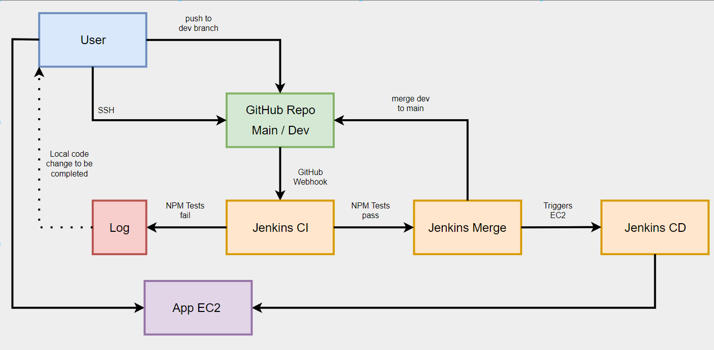
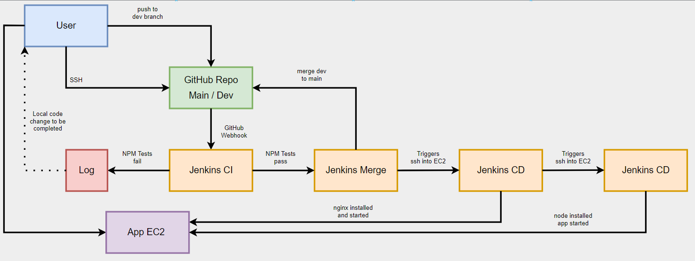

# Stages of CI/CD with Jenkins

## Stage 2

1. The user sets up a local repo.
2. User connects this via SSH to GitHub.
3. User checkouts out Dev branch on local repo, seperate from main.
   1. Main branch will now not be actively worked on.
   2. Only Dev branch will be worked on.
   3. Main exists for production ready code only.
   4. Dev branch, when tested, will be merged with Main.
4. User sets up Jenkins CI job:
   1. Uses GitHub webhook using SSH to check for when pushes are made to Dev branch.
   2. Copies code onto EC2 instance.
   3. Runs `npm test` on copied code.
   4. If it fails, a log is generated. User must use this log to find out where failure was, and rectify.
   5. If it passes, Jenkins points to next Jenkins job (Post-Build).
5. User sets up Jenkins Merge job:
   1. Runs Post-Build from previous job, only if it works.
   2. Merges Dev branch to Main using Git Publisher.
   3. Triggers next Jenkins CD job.
6. User sets up app EC2:
   1. Launch EC2 instance.
   2. Standard set up.
   3. Security groups on ports 3000, 22, and 80.
7. User sets up Jenkins CD job:
   1. Execute Shell command to sync Jenkins EC2 with user EC2 ip.
   2. SSH using "StrictHostKeyChecking=no" to bypass authentification check.
   3. Run relevant commands to set up and run nginx.
   4. BUILD MANUALLY FOR FIRST TEST.
8. Check EC2 public ip, verify nginx running.

## Stage 3

1. User sets up Jenkins app job:
   1. Allows Node.
   2. Execute Shell command to isntall node, pm2, install dependencies, and start the app on port 3000.

