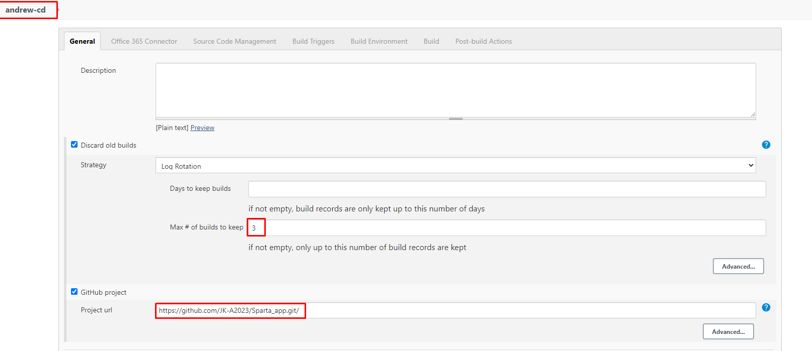
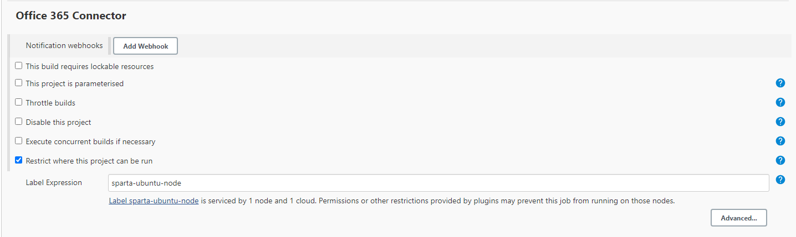
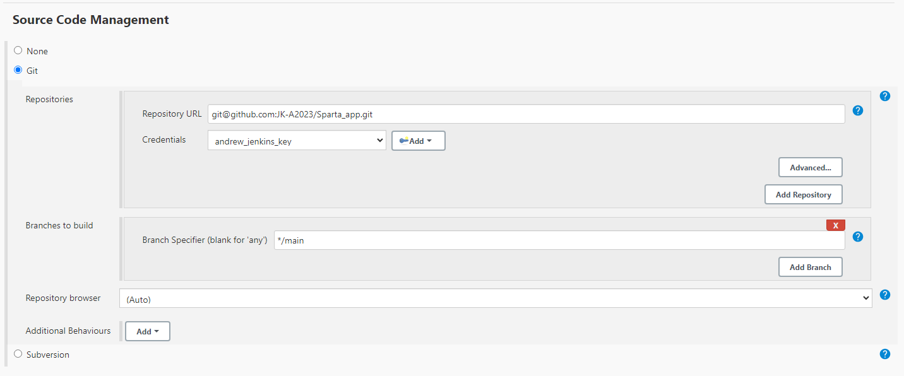
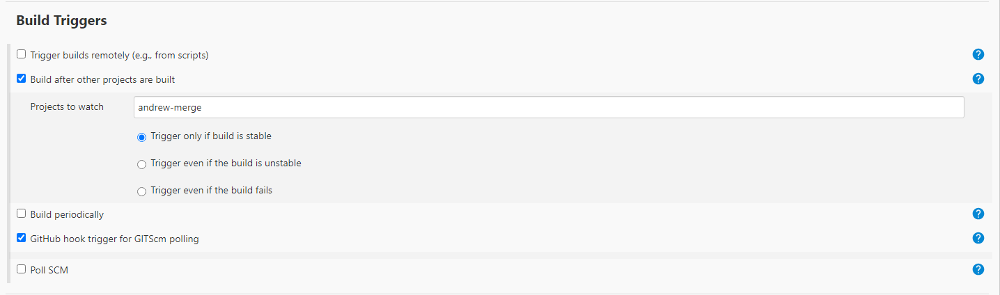
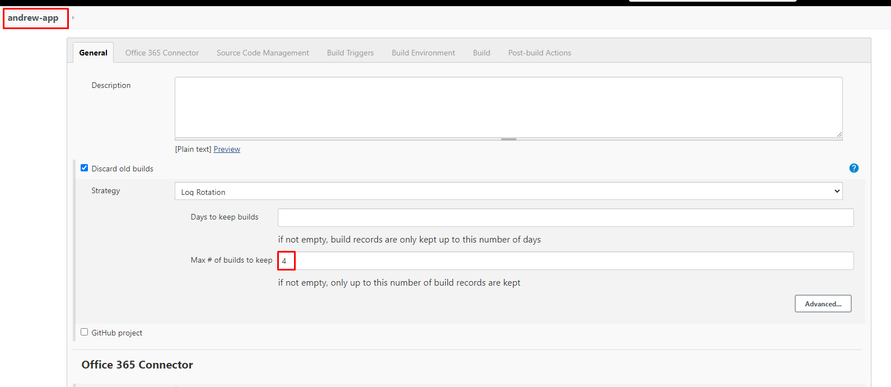
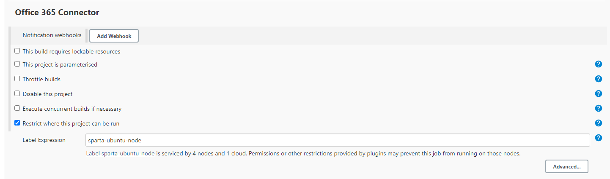
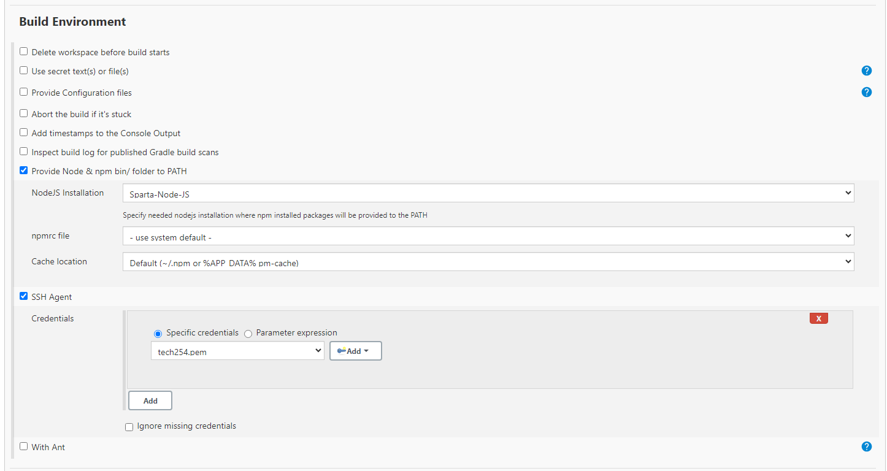

# Setting up CD

## App EC2:

### Launch EC2 instance.

1. Using `ami-0136ddddd07f0584f` for AMI.
2. Security Groups:
   1. Port 3000 - Node app listens on 3000
   2. 22 - ssh
   3. 80 - HTTP

## Jenkins-CD

Set up third job:

### General

1. Max builds: 3
2. GitHub Project: `https://github.com/JK-A2023/Sparta_app.git`



### Office 365 Connector:

1. Restrict where project can be run: `sparta-ubuntu-node`



### Source Code Management:

1. Enable Git.
2. Repository URL: `git@github.com:JK-A2023/Sparta_app.git` 
3. Credentials: `andrew_jenkins_key`
4. Branch to build: `*/main`



### Build Triggers:

1. Build after other projects: `andrew-merge`
2. GitHub hook trigger: `enable`



### Build Environment:

1. SSH Agent: `tech254.pem`


### Build:

1. Set up execute shell:

```
rsync -avz -e "ssh -o StrictHostKeyChecking=no" app ubuntu@<ec2_public_ip_here>:/home/ubuntu/

ssh -o "StrictHostKeyChecking=no" ubuntu@<ec2_public_ip_here> <<EOF
	sudo apt-get update -y
    sudo apt-get upgrade -y
    sudo apt-get install nginx -y
    sudo systemctl restart nginx 
    sudo systemctl enable nginx
    
EOF
```

### Test:

Before using sequence, always build independently first, to see if it works.

## Jenkins-App

Set up fourth job:

### General:

1. Add (and change in all oder jobs) 4 builds to keep:



### Office 365 Connector:



### Source Code Management & Build Triggers:


### Build Environment:

1. Provide Node
2. SSH Agent



### Build:

1. Execute Shell:

```

ssh -A -o "StrictHostKeyChecking=no" ubuntu@34.249.110.64 <<EOF

    #install correct Nodejs version
    curl -sL https://deb.nodesource.com/setup_12.x | sudo -E bash -
    
    #install NodeJs, pm2
    sudo apt install nodejs -y
    sudo npm install pm2 -g
    
    cd app
    
    #Install dependencies
    npm install -y
    
    pm2 kill
    
    #Run file
    pm2 start app.js
```