# How to set up GitHub webhook with Jenkins

DISCLAIMER: Must already have credentials added.

### Create project:

1. Add a name
2. Freestyle Project
3. Ok

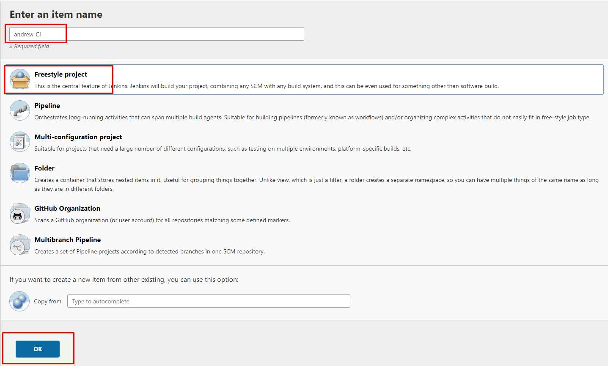

### General

1. Add description :

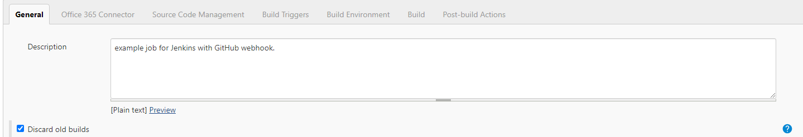

2. Discard old builds
   1. Max # of builds to keep: `3`

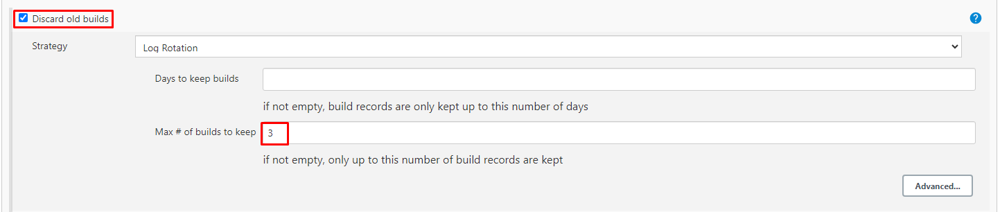

3. Enable Github Project.
4. Navigate to GitHub repo page.
   1. Click green code.
   2. Copy HTTPS url.

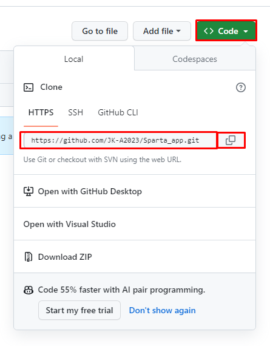
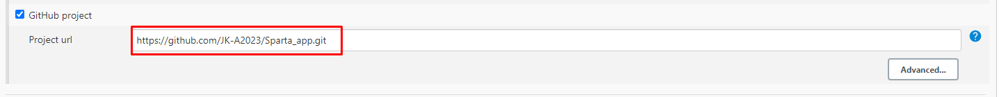

### Office 265 Connector

1. Restrict where this project can be run:
   1. specify `sparta-ubuntu-node`
   2. If using the drop down, make sure to delete the space it adds on at the end. No whitespace.

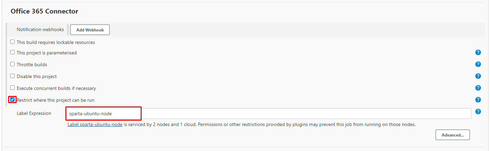

### Source Code Management:

1. Copy the same GitHub repo as before.
2. Use your credentials that you added previously.
3. Change branch specifier to main, NOT master.

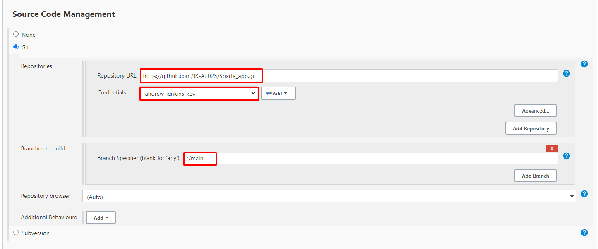

### Build Triggers:

1. Select GitHub hook trigger.

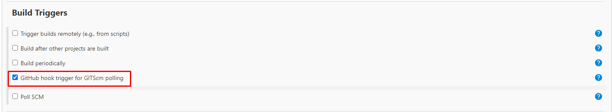

### Build Environment:

1. Select Provide Node

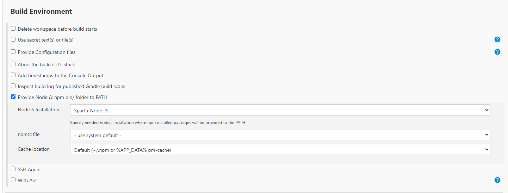

### Build:

1. Select add Build Steps
2. Select Execute Shell

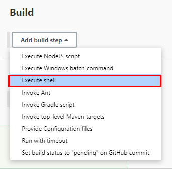

3. Add in your commands to ran on start:

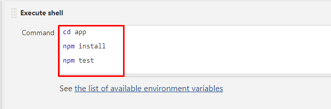

4. Save.

### Test Run:

1. Click on Build Now:

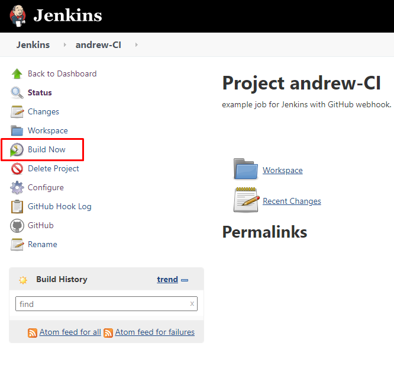

2. Refresh page. If it is blue, it has worked. Else, you have made a mistake.

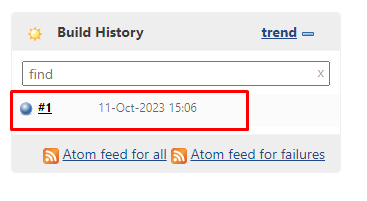

### GitHub Webhook.

1. Preemtively, we will copy our Jenkins address, up to the port:
   1. We will use this shortly.

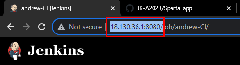

2. Navigate to your GitHub repo.
   1. Find the repo settings.
   2. Navigate to the Webhooks section.
   3. Click Add webhook.

3. In the Payload URL, paste in the copied portion of the URL.
4. After this is pasted, type the following:
   1. `github-webhook.`
5. Change content Type to `application/json`
6. Add webhook.

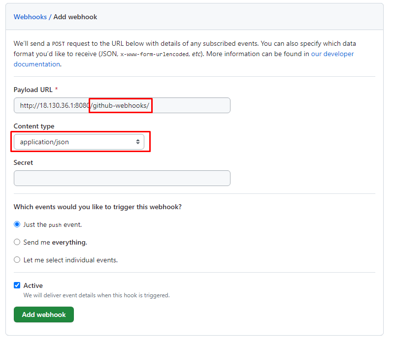

7. Refresh the page. If it has worked, there will be a little green tick.

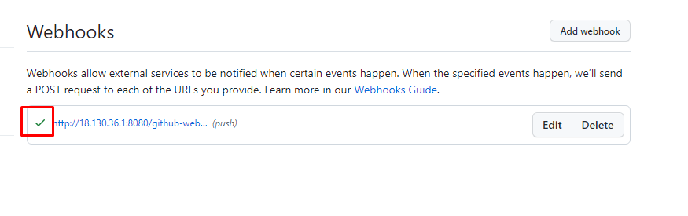

### Testing:

From here, make a small change to repo. When pushed to GitHub, it will communicate with Jenkins, starting the CI process, and automatically restart the instance with the changes made.